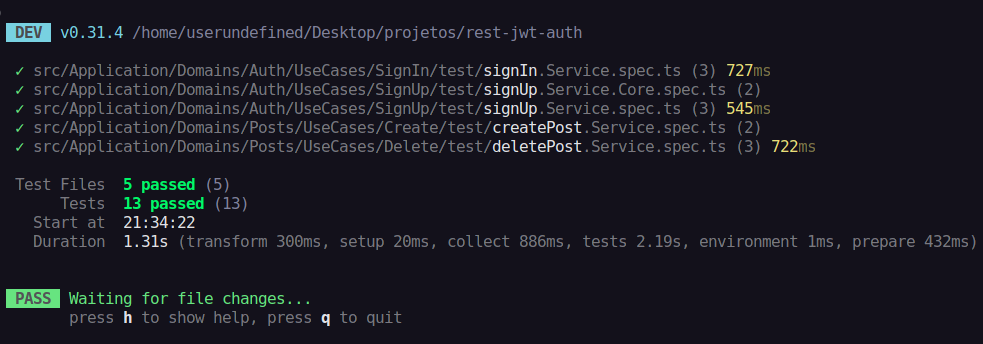
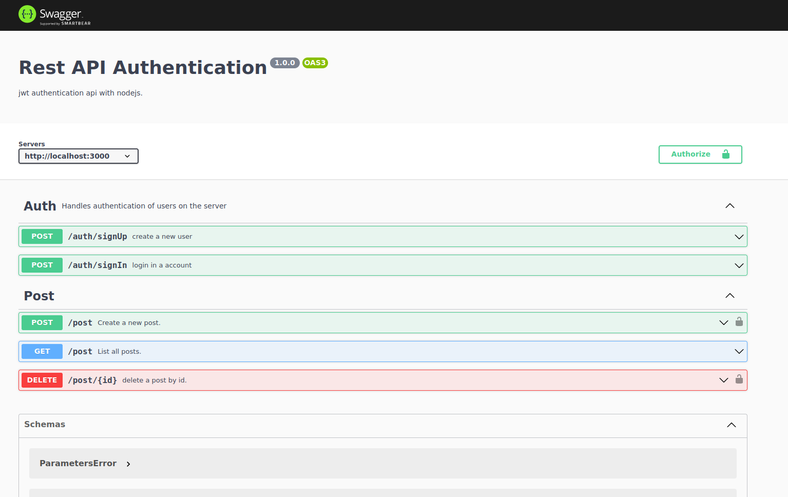

# Autenticação jwt no node com express e API rest


Este é um pequeno projeto que implementa uma api rest de autenticação usando o framework express e ele consiste em cadastrar usuários na plataforma e também fazer validações usando seu token de autenticação. ele é símples, porém, trouxe vários conceitos como arquitetura limpa, solid testes unitários, validações, contenerização... Além de ferramentas ultilizadas de grande relevância no ecossistema node.

Algo que deve ser observado é que, ele não utiliza banco de dados mas sim um repositório em memória, isto é proposital pois estou implementando inversão de dependência que é um dos conceitos do SOLID, por isso é fácil realizar a troca de repositório a qual vai ser ultilizado. Por mais que não esteja ultilizando qualquer banco de dados ou ORM ou algo semelhante, por isso está aplicação está muito flexível quando diz respeito de persistência de dados e pode ser configurada da forma que preferir.

## Algumas stacks são


- zod
- clear architecture
- SOLID
- unity test
- uuid
- bcrypt
- error handling


## Funcionalidades da aplicação

### Auth
- [x] Qualquer usuário poderá se cadastrar na plataforma
- [x] A senha deve conter no mínimo 6 caracteres
- [x] Qualquer usuário poderá fazer login usando as credenciais de forma correta
- [x] O email e o username devem ser únicos

### Post
- [x] Qualquer usuário cadastrado vai poder postar um post.
- [x] Qualquer usuário estando cadastrado ou não vai poder ver todos os posts.
- [x] Somente o author do post vai poder deleta-lo.

## Execução do projeto
antes de executar o projeto, é nescessário que na raiz do projeto tenha um arquivo .env criado contendo o seguinte conteúdo:

```env
JWT_SECRET=SRECRET #Chave secreta para assinar o token jwt.
```

O json web token usa uma chave que deve ser secreta para assinar ou validar o token, por isso ao subir o projeto para produção, deve se colocar uma chave forte para que não seja viável quebrar o token de autenticação.

### execução de desenvolvimento: via node
O projeto pode ser executado de duas formas. A primeira é via node tradicional o que é nescessário ter o node instalado no seu sistema operacional:

Antes de executar é necessário instalar as dependências do projetos rodando:
```console
npm install
```
Depois executar o servidor em modo de desenvolvimento:
```console
npm run dev
```

O servidor irá executar em: http://localhost:3000

### execução de desenvolvimento: via docker

```console
docker compose up
```

E da mesma forma o servidor vai executar em: http://localhost:3000, só que desta vez, rodando em um container docker espelhado na porta 3000 do seu SO.

### exeucução de build e produção
Ao subir o projeto para produção é necesário transpilar os arquivos typescript para javascript para que o node consiga entender de forma nativa, para isso rode o comando: 
```console
npm run build
```
Ao gerar a build do projeto, ele vai criar uma pasta na raiz chamada de build e dentro dela tem um arquivo server.js que será o nosso arquivo de execução principal. Para executar o projeto em produção basta rodar o comando:

```console
npm run start
```

## Testes

Os testes são uma parte muito importante da aplicação e é através deles que previnimos bugs e damos mais segurança ao projeto validando entradas, regras de negócio e muito mais. Os testes unitários nessa aplicação foi implementado ultilizado o [vitest](https://vitest.dev/) que é uma ferramenta semelhante ao jest porém muito mais rápida e mais eficiente.

Se você for executar no seu SO (sistema operacional), basta rodar o comando:

```console
npm run test
```

caso você queira executar os testes via container, primeiro você tem que acessar o bash do container do projeto através do comando:

```
docker exec -it rest-jwt-auth-server /bin/bash
```

e depois rodar os testes com:

```
npm run test
```


## Documentação da API



ao executar o servidor, você pode consultar a documentação em http://localhost:3000

eu ultilizei o [swagger ui express](https://github.com/scottie1984/swagger-ui-express) que é uma ferramenta para documentar APIs Rest que carrega a junto a ele [open api](https://www.openapis.org/) que é uma ferramenta de teste muito últil para ajudar no compreensão da api. O servidor swagger está disponível no domínio da aplicação.

